# Predicting Cardiovascular Disease (CVD)

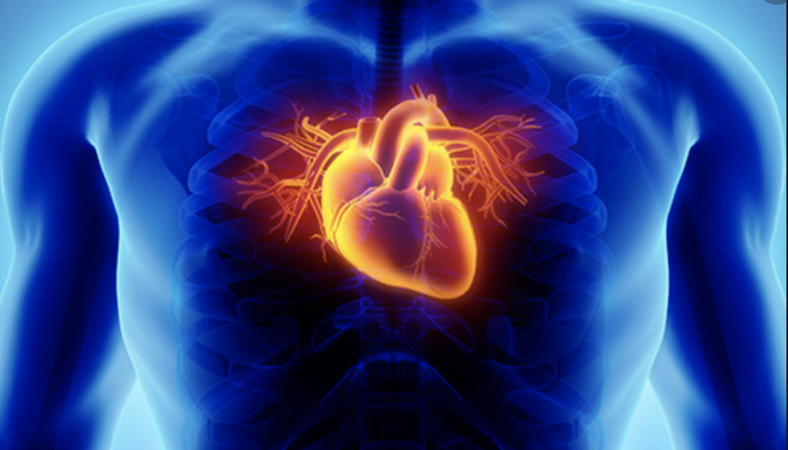
 
## Introduction
Cardiovascular diseases (CVDs) can refer to a number of heart conditions that include diseased vessels, structural problems and blood clots.
 
####   **Some of the most common conditions are:**
*   Coronary artery disease - Damage or disease in the heart's major blood vessels
*   High blood pressure - A condition in which the force of the blood against the artery walls is too high
*   Cardiac arrest - Sudden, unexpected loss of heart function, breathing, and consciousness
*   Congestive heart failure (CHF)- A chronic condition in which the heart doesn't pump blood as well
*   Arrhythmia- Improper beating of the heart, whether irregular, too fast, or too slow.
*   Peripheral artery disease- A circulatory condition in which narrowed blood vessels reduce blood flow to the limbs.
*   Stroke - Damage to the brain from interruption of its blood supply.
*   Congenital heart disease- An abnormality in the heart that develops before birth.
 
 
 
According to the world health organization, "Cardiovascular diseases (CVDs) are the number 1 cause of death globally, taking an estimated 17.9 million lives each year."  More people die annually from CVDs than from any other other causes, representing 31% of all global deaths.
 
## Goal
The goal of this study is to find a model that predicts the presence or absence of cardiovascular disease (CVD) using the patient's examination results. I would also like to research what factors are primary in predicting if a person has a CVD.
 
 
## Data
 
I obtained the Cardiovascular disease dataset from Kaggle. The origin is not stated. The dataset consists of the record of 70,000 patients and 12 features that contains their information. All of the dataset values were collected at the moment of medical examination.
 
- **The dataset has 3 types of input features:**
- Objective: factual information (patient’s age, weight…)
- Examination: results of medical examination (level of cholesterol, glucose)
- Subjective: information given by the patient (do they smoke, drink…)
 
| Features | Description | Column name | Datatype
| --- | --- | --| -- |
Age | Objective Feature | age | int (days)
Height | Objective Feature | height | int (cm) |
Weight | Objective Feature | weight | float (kg) |
Gender | Objective Feature | gender | categorical -  code 1: women, 2:men |
Systolic blood pressure | Examination Feature | ap_hi | int |
Diastolic blood pressure | Examination Feature | ap_lo | int |
Cholesterol | Examination Feature | cholesterol | categorical - 1: normal, 2: above normal, 3: well above normal |
Glucose | Examination Feature | gluc | categorical- 1: normal, 2: above normal, 3: well above normal |
Smoking | Subjective Feature | smoke | binary- 0:no, 1:yes|
Alcohol intake | Subjective Feature | alco | binary- 0:no, 1:yes |
Physical activity | Subjective Feature | active | binary- 0:no, 1:yes|
Presence or absence of cardiovascular disease | Target Variable | cardio | binary- 0:no, 1:yes |
 
This is what the original dataset looked like. The top 5 rows.
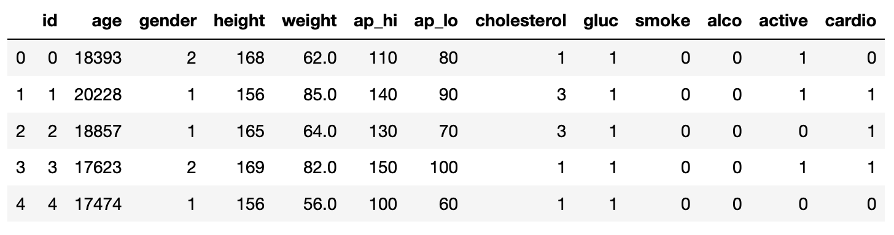
 
 
**The following actions are taken to transform the data**
 
The dataset didn't have any nan values. However, the features of the blood pressure measurements had some pretty high outliers.

Systolic blood pressure: The top number in blood pressure reading refers to the amount of pressure in your heart when it beats, squeezes and pushes blood through your arteries to the rest of your body.
 
Diastolic pressure:  The bottom number in a blood pressure reading refers to the amount of pressure in your arteries when your heart is at rest between beats.
 
Blood pressure is measured in millimeters of mercury (mm Hg).

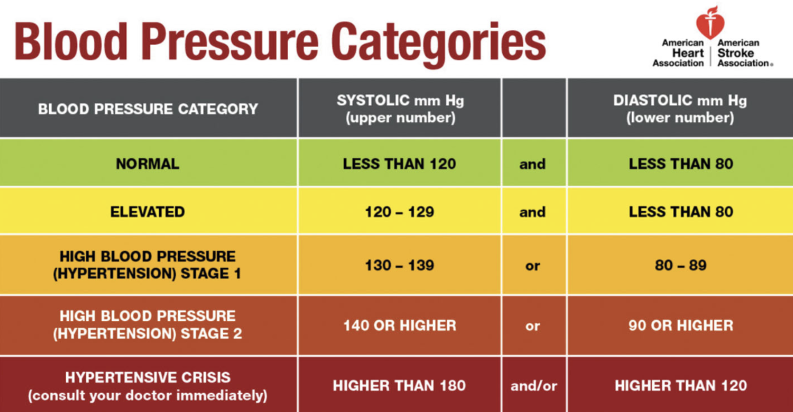

As seen from the picture above, blood pressure above 180/120 (mmHg) is considered hyperternsive crisis. I had some rows that had blood pressure recorded of bigger than 1000. 
 
According to an article published at the National Library of Medicine - National Center for Biotechnology Information,  the highest blood pressure recorded in an individual was 370/360 (mmHG). I used those numbers to set the limit on my dataset for those variables, and delet the outliers. 
 
The data had 40 rows that had systolic blood pressure greater than 370, and 953 rows that had diastolic blood pressure greater than 360. I decided to drop those rows - a total of 993.
 
## EDA and Feature Engineering
 
This section uses data exploratory analysis to investigate features that might be good predictors of whether a person has cvd or not.
 
First it will explore the objective features, such as age, and BMI.
 
**Age**
 
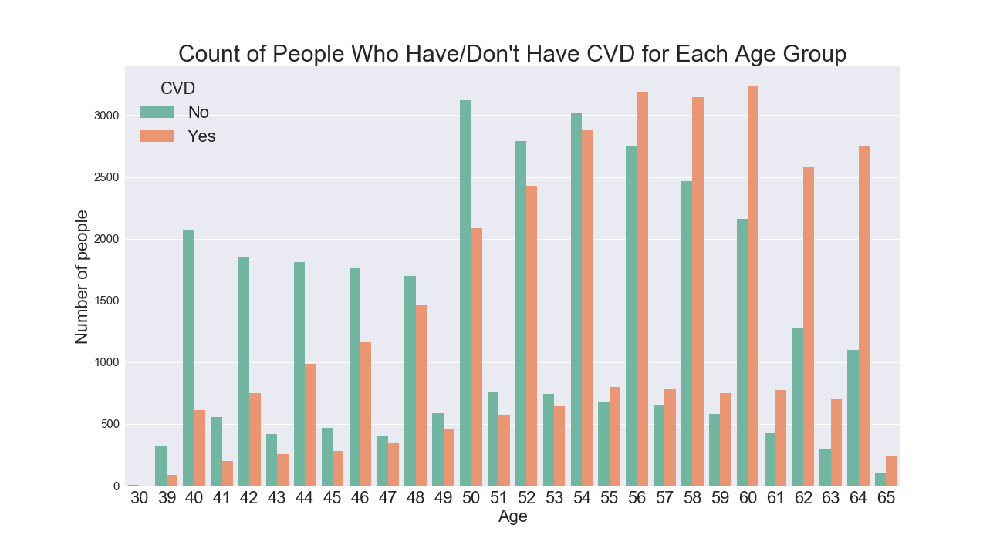
 
Age can be a possible predictor for the presence of CVD. As seen from the bar plot the count of people who don't have CVD is higher for the age group below 54 years old. As the age increases, after 54 years more people have CVD than those who don't.
 
 
**BMI**
 
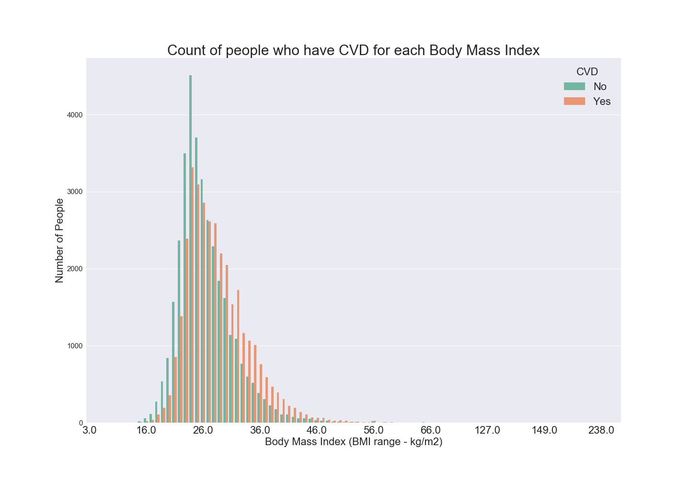
 
The body mass index is taken by dividing the weight by the height. The barplot shows there are more people who don't have CVD than people who have BMI of less than 27. The trend generally shows that, for those people who have a BMI of 27 or larger, there are more people who have CVD than those who don't. While the opposite is true for when BMI is less than 27. 
 
**Gender**

 
The gender doesn't really show much difference.
 
 
Exploration of examination features such as cholesterol and glucose:
 
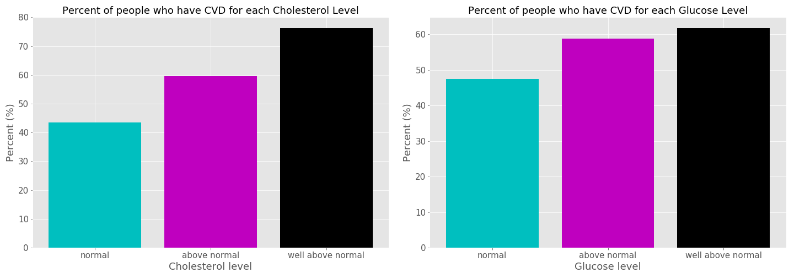
A cholesterol test is a blood test that measures the amount of each type of cholesterol and certain fats in your blood. The levels are measured in milligrams (mg) of cholesterol per deciliter (dL) of blood. Too much LDL cholesterol in your blood may put you at risk for heart disease and other serious conditions. LDL cholesterol is often called the "bad" cholesterol because it collects in the walls of your blood vessels, raising your chance of heart problems. This is evident in the dataset. As shown in the bar plot, the percent of people who have CVD increases with higher cholesterol level.
 
 
Similarly the percent of people who have glucose also increases as glucose level increases. A blood glucose test measures the amount of glucose in your blood.The international standard way of measuring blood glucose levels is in terms of a molar concentration, measured in mmol/L (millimoles per litre; or millimolar, abbreviated mM). High sugar levels slowly erode the ability of cells in your pancreas to make insulin. The organ overcompensates and insulin levels stay too high. Over time, the pancreas is permanently damaged.
High levels of blood sugar can cause changes that lead to a hardening of the blood vessels, what doctors call atherosclerosis, raising your risk of developing CVDs.
 
 
Exploration of subjective features given by the patients, such as smoking, drinking, exercise.
 
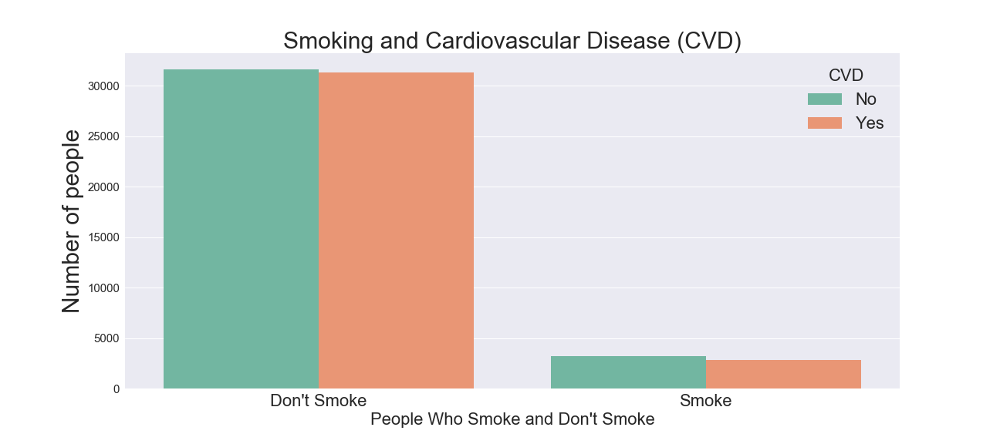
 
Majority of the people in the dataset reported that they do not smoke. Not a significant observation can be made between smoking and CVD. Of the people who reported that they do not smoke about half of them have CVD while the other half doesn't. Similarity of the people who reported that they do smoke, which is a very small number of people in the dataset, about half of them have cvd.
 
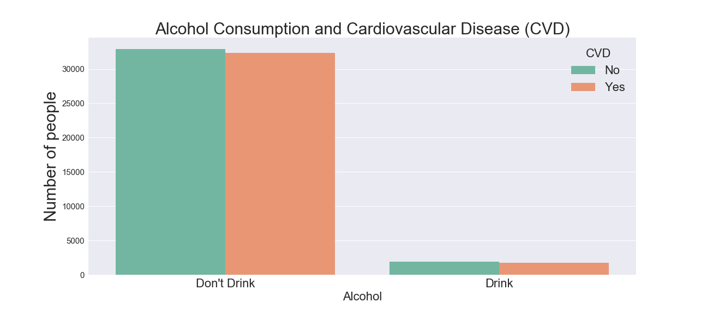
 
Again, the vast majority of people in the dataset reported that they do not drink alcohol. No strong correlation is observed between the relationship of CVD and alcohol consumption.
 

 
The majority of people reported that they exercise. Among the people who reported that they are active the presence of CVD is slightly lower by a very small amount. The number of people who have CVD is slightly higher among people who are not active.
 
With the initial data EDA, I made the choice to select the following variables that show strong relationship to CVD to create my models:
 
- Age
- BMI
- Cholesterol level
- Glucose level
- Systolic blood pressure
- Diastolic blood pressure
 
For Glucose level, and Cholesterol level additional feature engineering is performed to encode the categorical values.
 
 
### Sampling, Modeling & Comparison
 
I compared Random Forest Classifier and Gradient Boosting Classifier to see which model has a good predictive power to detect CVD. I also used RandomizedSearchCV to find the best hyper-parameters. The target variable of the dataset is balanced, with people having CVD making up 48% of the data.
 
The chosen hyper-parameters using 100 desired iterations are listed in the below table.

| RandomForestClassifier | GradientBoostingClassifier |
| ------------- | ------------- |  
| n_estimators=90 | n_estimators=100 |
|min_samples_split=3|min_samples_split=30|
| min_samples_leaf= 3 |min_samples_leaf= 1 |
| max_features= auto |max_features= sqrt |
| max_depth= None| max_depth= None|
| criterion = gini| learning_rate = .02|

The resulting model metrics are 

| metrics | RandomForestClassifier | GradientBoostingClassifier |
| ------------- | ------------- | ------------- | 
| Accuracy | 0.758 | 0.743 |
| Precision | 0.764 | 0.736 |
| Recall | 0.713 | 0.704 |

For this study, recall is the metric that we care most about. We want to penalize false negatives. That is we don't want to minimize the model predicting negative when the person has CVD. Out of the two models Random Forest gives a better recall score. 

**Next we will look at Feature Importance**

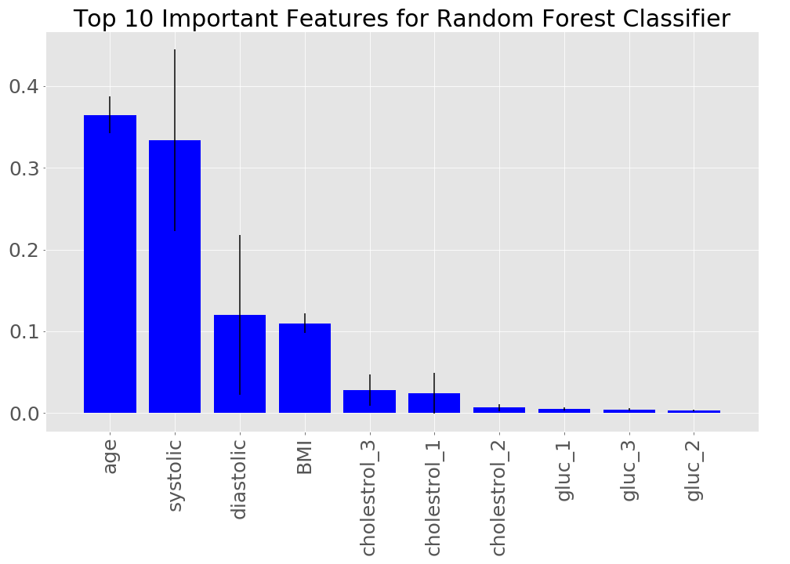
The 5 most important features for Random Forest are age, systolic blood pressure, diastolic blood pressure, BMI, and well above normal cholestrol level. About 36.6% of information gain is done by age, followed by systolic blood pressure information gain of 31.2%,  13% by diastolic blood pressure, and less than 1% for the rest of the features. 

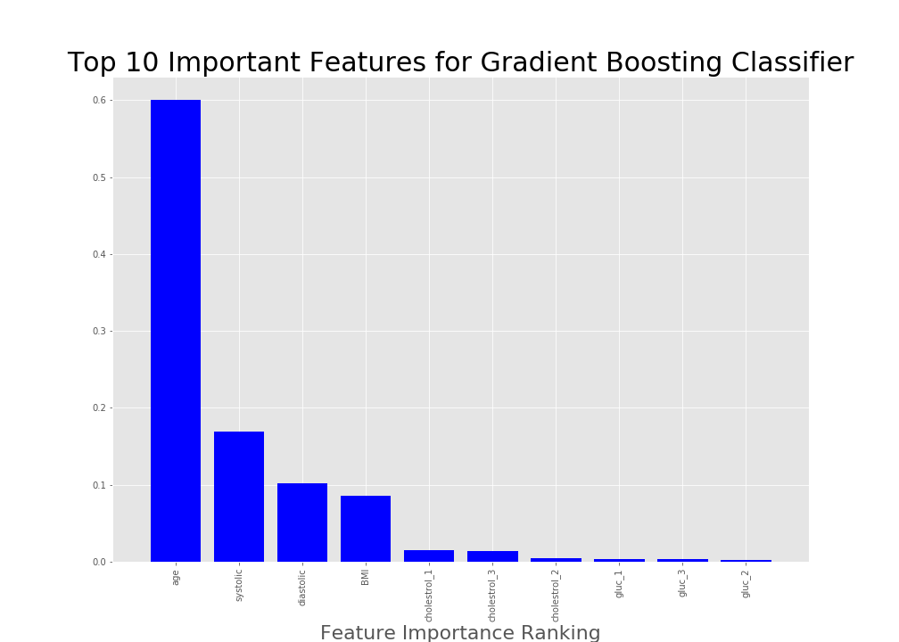
The 5 most important features for Gradient Boosting are age, systolic blood pressure, diastolic blood pressure, BMI, and normal cholestrol level. About 60% of information gain is done by age, followed by 17 % for systolic blood pressure and less than 1% percent for diastolic and the rest of the features. 

The two models identified the same 4 important top features. 

### **Roc curve** 

ROC curve shows the trade-off between the true positive rate and the false positive rate for each level of threshold. The bigger the total area under the ROC curve, the better the model preformance. The plot below shows the ROC curve for random forest and gradient boosting. 

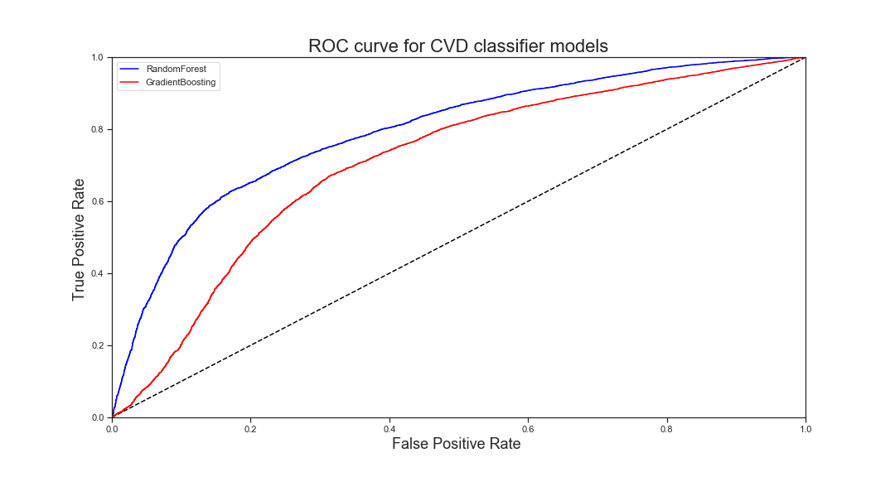

Random forest has the biggest area under the curve and shows that it preforms best. 

### 
###conclusion 

The goal of this study was to find the best model. I compared Random Forest Classifier and Gradient Boosting Classifier using Random Search CV to find the best parameters. Using recall as the primary metric, Random Forest gaves the best result. 

### further work 

* Use the top 4 variables to run the models again. 
* partial dependency plot of random forest. 

### Sources

* https://pubmed.ncbi.nlm.nih.gov/7741618/#:~:text=The%20highest%20pressure%20recorded%20in,
maximal%20lifting%20with%20slow%20exhalation.

* https://www.webmd.com/heart-disease/ldl-cholesterol-the-bad-cholesterol#1

*https://www.webmd.com/heart-disease/ss/slideshow-heart-disease-surprising-causes