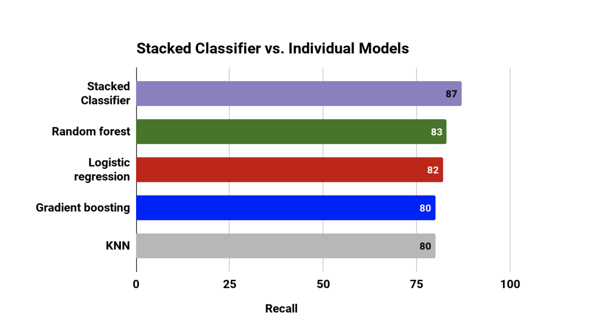
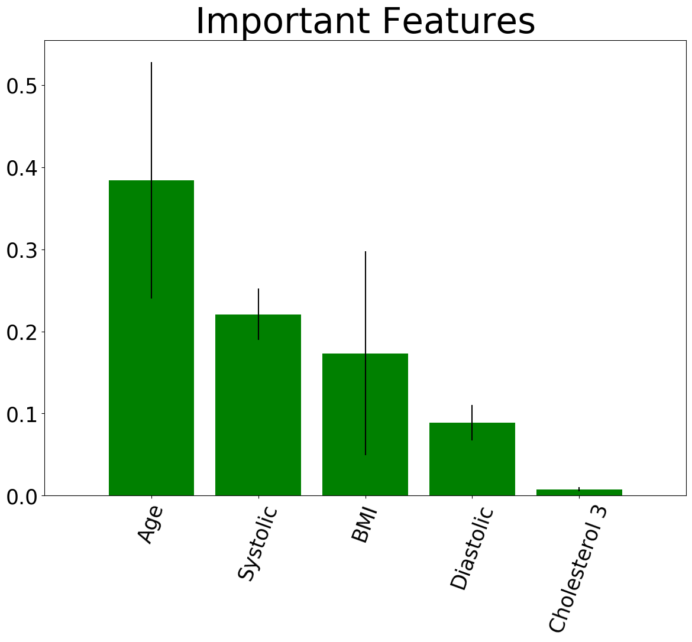

# Predicting Cardiovascular Disease (CVD)

 
## Introduction
Cardiovascular diseases (CVDs) can refer to a number of heart conditions that include diseased vessels, structural problems and blood clots.
 
####   **Some of the most common conditions are:**
*   Coronary artery disease - Damage or disease in the heart's major blood vessels
*   High blood pressure - A condition in which the force of the blood against the artery walls is too high
*   Cardiac arrest - Sudden, unexpected loss of heart function, breathing, and consciousness
*   Congestive heart failure (CHF)- A chronic condition in which the heart doesn't pump blood as well
*   Arrhythmia- Improper beating of the heart, whether irregular, too fast, or too slow.
*   Peripheral artery disease- A circulatory condition in which narrowed blood vessels reduce blood flow to the limbs.
*   Stroke - Damage to the brain from interruption of its blood supply.
*   Congenital heart disease- An abnormality in the heart that develops before birth.
 
 
According to the World Health Organization, "Cardiovascular diseases (CVDs) are the number 1 cause of death globally, taking an estimated 17.9 million lives each year."  More people die annually from CVDs than from any other other causes, representing 31% of all global deaths (WHO).
 
## Goal
The goal of this study is to find a model that predicts the presence or absence of cardiovascular disease (CVD) using the patient's examination results. I would also like to research what factors are primary in predicting if a person has a CVD.
 
 
## Data
 
I obtained the Cardiovascular disease dataset from Kaggle. The origin is not stated. The dataset consists the records of 70,000 patients and 12 features that contains their information. All of the dataset values were collected at the moment of medical examination.
 
- **The dataset has 3 types of input features:**
- Objective: factual information (patient’s age, weight…)
- Examination: results of medical examination (level of cholesterol, glucose)
- Subjective: information given by the patient (do they smoke, drink…)
 
| Features | Description | Column name | Datatype
| --- | --- | --| -- |
Age | Objective Feature | age | int (days)
Height | Objective Feature | height | int (cm) |
Weight | Objective Feature | weight | float (kg) |
Gender | Objective Feature | gender | categorical -  code 1: women, 2:men |
Systolic blood pressure | Examination Feature | ap_hi | int |
Diastolic blood pressure | Examination Feature | ap_lo | int |
Cholesterol | Examination Feature | cholesterol | categorical - 1: normal, 2: above normal, 3: well above normal |
Glucose | Examination Feature | gluc | categorical- 1: normal, 2: above normal, 3: well above normal |
Smoking | Subjective Feature | smoke | binary- 0:no, 1:yes|
Alcohol intake | Subjective Feature | alco | binary- 0:no, 1:yes |
Physical activity | Subjective Feature | active | binary- 0:no, 1:yes|
Presence or absence of cardiovascular disease | Target Variable | cardio | binary- 0:no, 1:yes |
 
This is what the original dataset looked like. The top 5 rows.

 
 
### **The following actions are taken to transform the data**
 
The dataset didn't have any nan values. However, the features of the blood pressure measurements had some pretty high outliers.

Systolic blood pressure: The top number in blood pressure reading refers to the amount of pressure in your heart when it beats, squeezes and pushes blood through your arteries to the rest of your body.
 
Diastolic pressure:  The bottom number in a blood pressure reading refers to the amount of pressure in your arteries when your heart is at rest between beats.
 
Blood pressure is measured in millimeters of mercury (mm Hg).

As seen from the picture above, blood pressure above 180/120 (mmHg) is considered hyperternsive crisis. I had some rows that had blood pressure recorded higher than 1000. 
 
According to an article published at the National Library of Medicine - National Center for Biotechnology Information,  the highest blood pressure recorded in an individual was 370/360 (mmHG). I used those numbers to set the limit on my dataset for those variables, and deleted the outliers. 
 
The data had 40 rows that had systolic blood pressure greater than 370, and 953 rows that had diastolic blood pressure greater than 360. I decided to drop those rows - a total of 993. Leaving me with about 69,000 rows to work with. 
 
## EDA and Feature Engineering
 
This section uses data exploratory analysis to investigate features that might be good predictors if whether a person has cvd or not.
 
First it will explore the objective features, such as age, and BMI.
 
**Age**
 

 
Age can be a possible predictor for the presence of CVD. As seen from the bar plot the count of people who don't have CVD is higher for the age group below 54 years old. As the age increases, after 54 years more people have CVD than those who don't.
 
 
**BMI**
 

 
The body mass index is taken by dividing the weight by the height. The barplot shows that most people who have BMI of less than 27 do not have CVD. The trend generally shows that, for those people who have a BMI of 27 or larger, there are more people who have CVD than those who don't. While the opposite is true for when BMI is less than 27. 
 
**Gender**

 
The only thing this feature shows is that there are twice as many women as there are men in the dataset. For each gender, the number of people who have CVD is almost equivalent to the number of people who do not have CVD. 
 
 
#### Exploration of examination features such as cholesterol and glucose:
 

A cholesterol test is a blood test that measures the amount of each type of cholesterol and certain fats in your blood. The levels are measured in milligrams (mg) of cholesterol per deciliter (dL) of blood. Too much LDL cholesterol in your blood may put you at risk for heart disease and other serious conditions. LDL cholesterol is often called the "bad" cholesterol because it collects in the walls of your blood vessels, raising your chance of heart problems. This is evident in the dataset. As shown in the bar plot, the percent of people who have CVD increases with higher cholesterol level.
 
 
Similarly the percent of people who have glucose also increases as glucose level increases. A blood glucose test measures the amount of glucose in your blood.The international standard way of measuring blood glucose levels is in terms of a molar concentration, measured in mmol/L (millimoles per litre; or millimolar, abbreviated mM). High sugar levels slowly erode the ability of cells in your pancreas to make insulin. The organ overcompensates and insulin levels stay too high. Over time, the pancreas is permanently damaged.
High levels of blood sugar can cause changes that lead to a hardening of the blood vessels, what doctors call atherosclerosis, raising your risk of developing CVDs.
 
 
Exploration of subjective features given by the patients, such as smoking, drinking, exercise.
 

 
Majority of the people in the dataset reported that they do not smoke. Not a significant observation can be made between smoking and CVD. Of the people who reported that they do not smoke about half of them have CVD while the other half doesn't. Similarly of the people who reported that they do smoke, which is a very small number of people in the dataset, about half of them have cvd.
 

 
Again, the vast majority of people in the dataset reported that they do not drink alcohol. No strong correlation is observed between the relationship of CVD and alcohol consumption.
 

 
The majority of people reported that they exercise. Among the people who reported that they are active the presence of CVD is slightly lower by a very small amount. The number of people who have CVD is slightly higher among people who are not active.

## **Data Transformation steps** 

below is the process taken to compute my results.
 
- For Glucose level and Cholesterol level, additional feature engineering is performed to encode the categorical values. 
- The values of 1 and 2 for the Gender column in reference to women and men, respectivily, was also changed to 0 and 1 so that it doesn't create weight problem during modeling. 
- There is no balancing issue, since the target variable of the dataset is very balanced, with people having CVD making up 48% of the data. 
- The columns for height and weight were dropped since feature engineering of a BMI column was done using them. The column for patients ID was also dropped. 
 
 
### Sampling, Modeling & Comparison

I compared 4 different models: Random Forest Classifier, Gradient Boosting Classifier, Logistic Regression and K-neighers neighbors (KNN). First the data was scaled to have mean of 0 and standard deviationof 1. For the first three models, RandomizedSearchCV was used to find the best hyper-parameters. 

For KNN an elbow plot was preformed to see the most optimized number of k neighbors. 

Based on the plot, a k value of 27, which has the least error rate was chosen for the number of neighbors. 

## The resulting model metrics are:

Metrics| Accuracy | Precision | Recall |
------------- | ------------- | ------------- |  ------------- |  ------------- |
RandomForestClassifier | 0.730  | 0.710 | 0.831 |
GradientBoostingClassifier | 0.690 | 0.680 | 0.79 |
LogisticRegression | 0.711 | 0.701 | 0.823 |
KNeighborsClassifier | 0.711 | 0.701 | 0.800 |

For this study, recall is the metric that we care most about. We want to penalize false negatives. That is we want to minimize the model predicting negative when the person has CVD. We are dealing with a problem of a disease impacting a human health, so we want to lower the risk of predicting a CVD case as Non CVD (False Negative) because it will be jeopardizing a person's life. 

The second important metric is precision. While we don't want our model to predict negative for a person who has CVD. We also want to minimize our model predicting positive for a person who doesn't have CVD.  A high number of false positive can be costly for hospitals, and the patients because of all the false medial examinations. 

To properly choose the optimal treshold for each model, a precision and recall curve was also computed to see the tradoff score for the two metrics. Based on the plot a treshhold of .3 was chosen. 

Random Forest gives the best score on all the metrics. However, the four models seem on par with each other for the most part. Next I will try stacking them together to see if the four models can learn from each other to generate a highet score. 

Model stacking is an efficient ensemble method in which the predictions, generated by using various machine learning algorithms, are used as inputs in a second-layer learning algorithm. This second-layer algorithm is trained to optimally combine the model predictions to form a new set of predictions.

In this case since RandomForest gave the highest result, I will take the predicted weighted average of the first three models- LogisticRegression, GradientBoosting, and KNN , and use that as input for Random Forest. 

The stacked model gave a higher recall score. The 4 models recall score is depicted in the plot above. 

**Given the results above, ROC curve was plotted to compare the area under the curve** 

Receiver operating characterstic curve shows the trade-off between the true positive rate and the false positive rate for each level of threshold. The bigger the total area under the ROC curve, the better the model preformance. The plot above shows the ROC curve for all the competing models. The goal is to see if the stacked model is better than the 4 models individually. The stacked model has the biggest area under the curve and shows that it preforms best, while RandomForest is a close second. 

## Evaluation of the Model results  

14,000 rows were used for testing my model.  Of the people who have CVD the Stacked Classifier was was able to correctly capture 92% of them. The model incorrecly classified 8% of them as not having CVD. Similarly, the model accuratly captured 76% of the people who don't have CVD and incorrecly classified the rest as having CVD. Because recall measures the ability of the model to 
find all people with CVD, the model tried to minimize all the false negatives. 

## Further understanding of Features 

**Feature Importance**

Feature importance shows the variables that were the most useful at predicting if a patient has cardiovascular disease. 
The top 10 most important features for Random Forest are age, systolic blood pressure, BMI,diastolic blood pressure,and well above normal cholestrol level. About 38.6% of information gain is done by age, followed by information gain of 22% for Systolic blood pressure,  16% by BMI, .09% for diastolic blood pressure, and less than .02% for Cholestrol level 3. 

- The top 10 features contain 99% of the information gain that was done by the model. 

- The error bars demonstrate the range of information that was done by each tree for that variable. 

What's important to note here is that none of the self reported features such as smoking, drinking, exercise contributed to the 99% of information gain that was done by the model. As reported during the exploratory data analysis most people reported that they don't smoke, drink and that they are active. According to a study that was published in JAMA Network Open, "Up to 81% of patients lie to their doctors about how often they exercise, how much they eat, and other behaviors to avoid being judged." Since Chronic disease such as CVDs are stongly effected by behaviors (NIH), I think the model results could have improved with more accurate patient data. 

### Random Forest Partial Dependency 

The partial dependence plots show how each predictor affects the model's predictions. The Y-axis is measured on the log-odds scale. Meaning, a negative y value makes the positive class less likely. In other words, when it's a negative y value there is high change that the model will predict that a patient doesn't have CVD specially as it nears -1, while the opposite is true when it's a postive value.  For this plot, you can see how the chance of CVD increase as age (shown in days) increases. After systolic blood pressure of 125 mmHg the chance of CVD increases exponentially. While the effect of BMI on the model is pretty slim, it shows a steady increasing trend of a positive class after about BMI of 27. 

## Decision Boundries: 

### conclusion 

The goal of this study was to find the best model. I compared several models using Random Search CV to find the best parameters. For this dataset, using recall as the primary metric and with optimized threshold, Stacked Classifier gave a better result.  The stacked model also gave the largest area under a ROC curve. 

### further work 
In par with the explatory data analysis that was done initially, gender, smoking, alcohol, and excercise gave a very low signal for our model to train on.  So for further work I would like to: 

* Use the top fewer variables to run the models again and see if we can compute better results. 
* Perform PCA to see if we get better results
* Try deep learning neural networks. 

The pcs plot shows that almost 100% of the variance in the data is contained by 11 components. 

### Sources

* https://pubmed.ncbi.nlm.nih.gov/7741618/#:~:text=The%20highest%20pressure%20recorded%20in,
maximal%20lifting%20with%20slow%20exhalation.

* https://www.webmd.com/heart-disease/ldl-cholesterol-the-bad-cholesterol#1

* https://www.webmd.com/heart-disease/ss/slideshow-heart-disease-surprising-causes

* https://www.advisory.com/daily-briefing/2018/12/10/lying-patients#:~:text=Up%20to%2081%25%20of%20patients%20lie%20to%20their%20doctors%20about,can%20negatively%20affect%20patients'%20health.

* https://pubmed.ncbi.nlm.nih.gov/22997327/

